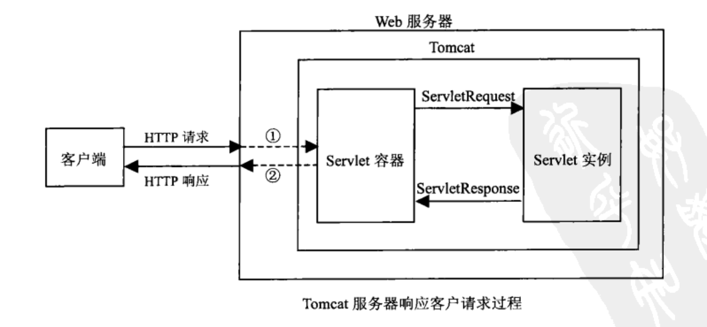

# Servlet

Servlet（Server Applet），是用 Java 编写的服务端程序。其设计的目的是用于交互式地浏览和修改数据，成圣动态的 Web 内容。

狭义的 Servlet 是指 Java 语言的一个接口，定义的是一套处理网络请求的规范。所有实现 Servlet 的类，都需要实现它那 5 个方法。

所有实现servlet接口的类，所有想要处理网络请求的类，都需要回答这三个问题：

- 初始化时做什么
- 销毁时做什么
- 接受请求时做什么

广义的Servlet是指的所有实现了该接口的类。

实现了Servlet接口的类也并不能直接处理网络请求，Servlet并不会与网络直接打交道，这部分的工作是由Servlet容器（例如Tomcat和Jetty）来实现的。Servlet与Servlet容器的关系相互依存，又独立发展。

## 基础

### 使用

Servlet 类的继承关系如下：

实现 Servlet 三种方式：

+ 实现 javax.servlet.Servlet 接口
+ 继承 javax.servlet.GenericServlet 类
+ 继承 Javax.servlet.http.HttpServlet 类

三种实现中，我们通常会去继承 HttpServlet 来实现 Servlet。

### 生命周期

Servlet 的生命周期入下图所示：

#### 初始化

Servlet 对象创建之后，立刻执行 `void init(ServletConfig servletConfig)` 方法进行初始化，并且只执行一次。

初始化的时机：

+ 容器启动时，若 Servlet 的 load-on-startup 属性设置为 1，会被初始化。属性设置可通过 web.xml 设置，也可以通过 Java 注解（Servlet 3.0 支持）。
+ 对于没有设置 load-on-startup 属性的 Servlet，将会在第一次请求该 Servlet 的时候进行初始化。

#### 服务中

初始化之后的 Servlet 会被 Servlet 容器维护在内存中，容器收到相应的请求之后，会调用相应 Servlet 的 `void service(ServletRequest servletRequest, ServletResponse servletResponse)` 方法。

#### 销毁

Servlet 对象通过调用 `void destroy()` 方法进行销毁，并且释放 Servlet 对象所占用的资源。

销毁的时机：

+ 容器关闭的时候进行 Servlet 的销毁。

### Servlet 执行过程

对于 Servlet 应用，一个请求从浏览器出，到服务端返回的全过程。

#### 请求发出

Servlet 的注册信息配置在 servlet-mapping 中，同样也有两种配置方式，通过 web.xml 文件配置和通过 Java 注解配置（Servet 3.0 支持）。

过程如下：

1. 浏览器发出 HTTP 请求。
2. 在 servlet-mapping 中通过 url-pattern 匹配到相应的 servlet 的名称。
3. 根据配置的 servlet 信息，通过 servlet 名称找到 servlet 对应的圈类全名。

#### Servlet 创建并初始化

容器根据 Servlet 类信息，通过反射创建 Servlet 对象。并且也创建了该 Servlet 的 servletConfig 对象，其中存放了一些初始化信息。（在单个的容器中，servlet 和 servletConfig 都只有一个）

Servlet 对象生成之后，执行 init 方法进行初始化，若自定义的类没有重写 init 方法。则会不断地去继承的父类中寻找相应的方法。

#### 执行服务并响应

在执行服务之前，容器会先创建请求和响应两个对象：ServletRequest 和 ServletResponse，这两个对象用来封装请求的数据和响应的数据。

具体的过程如下：

+ 容器会寻找 service 方法进行处理，若方法中，请求请求、相应的参数类型不会，会进行参数的装换。例如：ServletRequest 转换成 HttpServletRequest。
+ 在 service 方法中，可以进行判断，从而决定是否调用常用的方法，例如：doGet，doPost。
+ 最后将执行后的结果写入到 Response，即会返回给浏览器端。

### Servlet 容器

单独的 Servlet 无法运行，必须运行在 Servlet 容器中。因为 Servlet 并没有接受外部连接和响应数据给外部的功能，这些都是 Servlet 容器提供的。常用的 Servlet 容器有：Tomcat、Jetty 等。

Tomcat 是 Web 应用服务器，可作为 Servlet 容器，负责处理客户请求，把请求传送给 Servlet，并将 Servlet 的响应传送回给客户。

Servlet 和 Servlet 容器是相互依存的。Servlet 容器提供 Web 服务器的功能，完成连接和响应。而 Servlet 可以增加应用服务器的功能呢，使服务器能够处理业务相关的事情。

## Filter

filter 可以动态地拦截请求和响应，以变化或使用包含在请求或响应中的信息。filter 不是一个 Servlet，它不能产生一个 response，但它能够在一个 request 到达 Servlet 之前预处理 request，也可以在离开 Servlet 时处理 response。filter 其实是一个 “Servlet Chaining” (Servler 链)。

一个 filter 的作用包括以下几个方面：

1）在 Servlet 被调用之前截获

2）在 Servlet 被调用之前检查 Servlet Request

3）根据需要修改 Request 头和 Request 数据

4）根据需要修改 Response 头和 Response 数据

5）在 Servlet 被调用之后截获

## 补充

### Forward & Redirect

两者都能实现重定向的功能。具体的区别如下图所示：

**Forward**：服务器内部的重定向。服务器直接访问目标地址的 URL，把那个 URL 的响应内容读取过来，而客户端并不知道，因此在客户端浏览器的地址栏中不会显示转向后的地址，还是原来的地址。

**Redirect**：客户端的重定向。完全的跳转，即客户端浏览器会获取到跳转后的地址，然后重新发送请求，因此浏览器中会显示跳转后的地址。同事，由于这种方式比 forward 方式多了一次网络请求，因此其效率要低于 forward 方式。需要注意的是，客户端的重定向可以通过设置特定的 HTTP 头或改写 JavaScript 脚本实现。

# RESTful

表现层状态转换（Representational State Transfer）是 2000 年提出来的一种软件架构风格。

其全程为 Resource Representational State Transfer。通俗来讲就是，资源在网络中以某种表现形式进行状态转移。

可以这样理解，用 URL 来定位资源，使用 HTTP 动词（如：GET、POST、DELETE、PUT）来描述操作。

| 动词   | 描述                             |
| ------ | -------------------------------- |
| GET    | 用来获取资源                     |
| POST   | 用来新建资源(也可以用于更新资源) |
| PUT    | 用来更新资源                     |
| DELETE | 用来删除资源                     |

